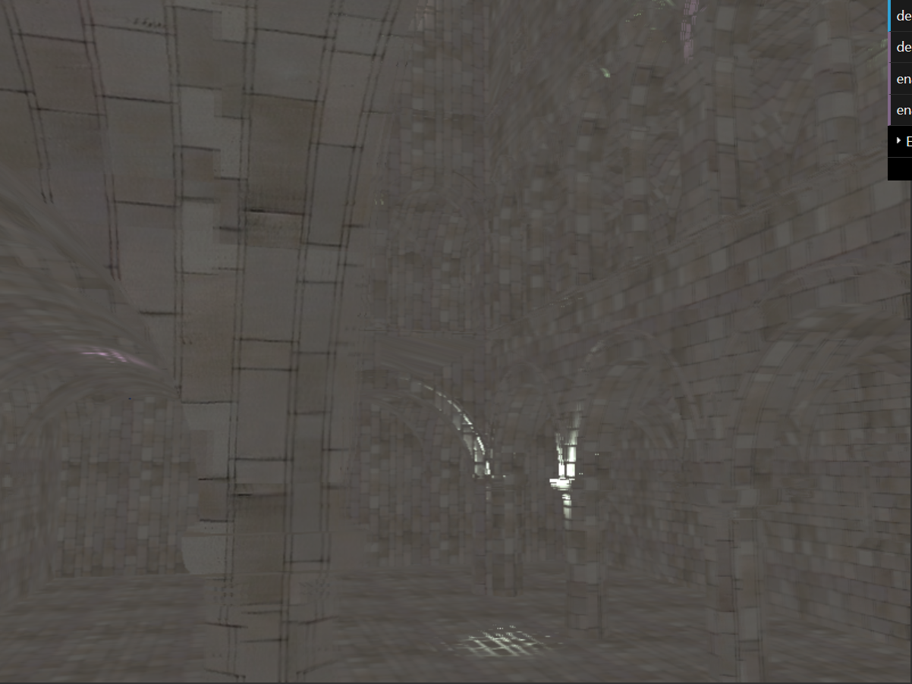
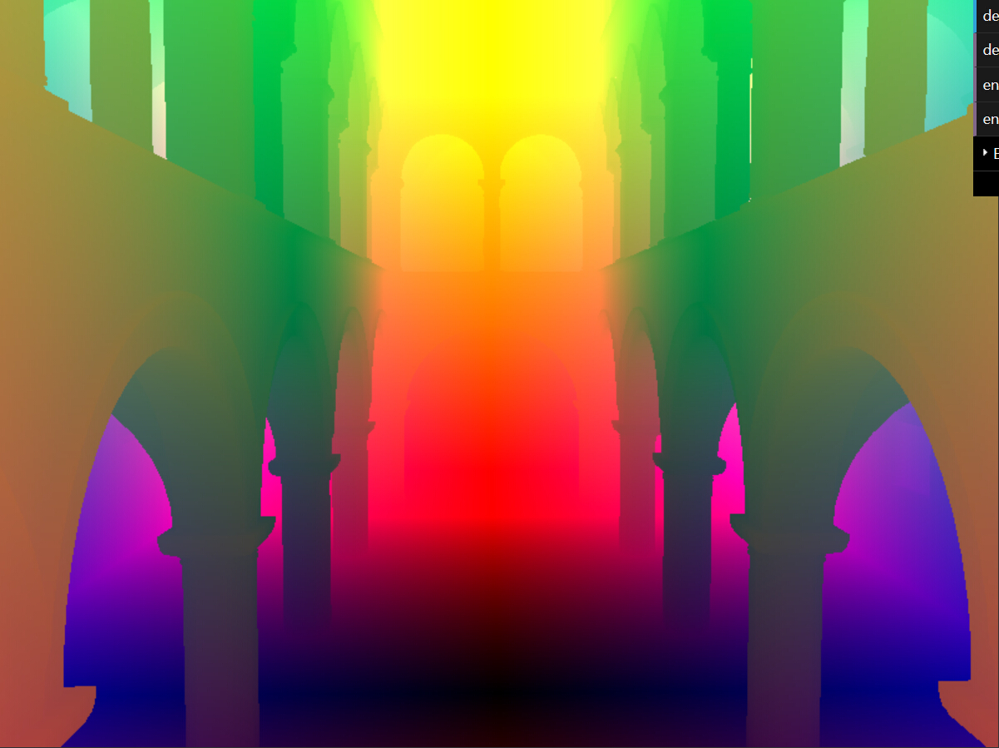
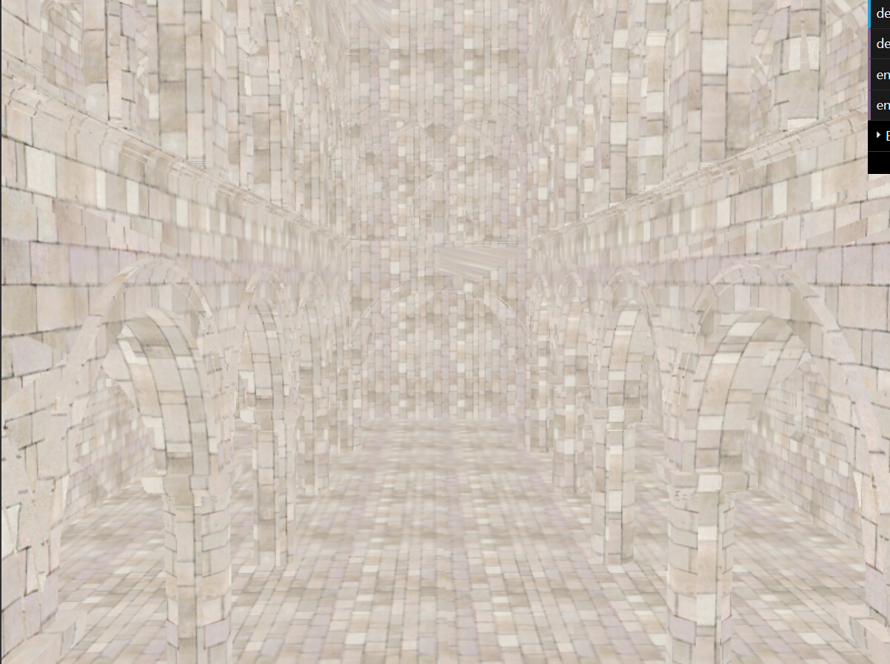
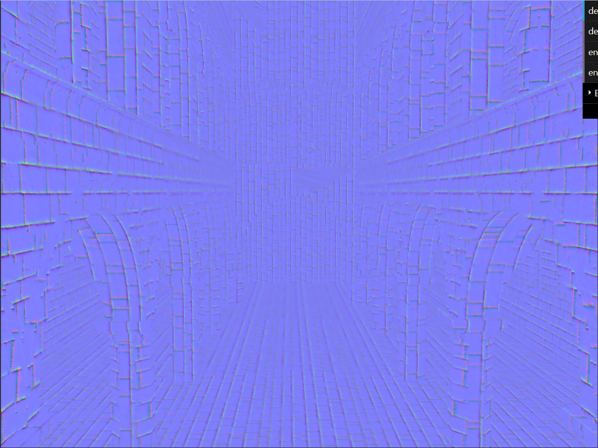
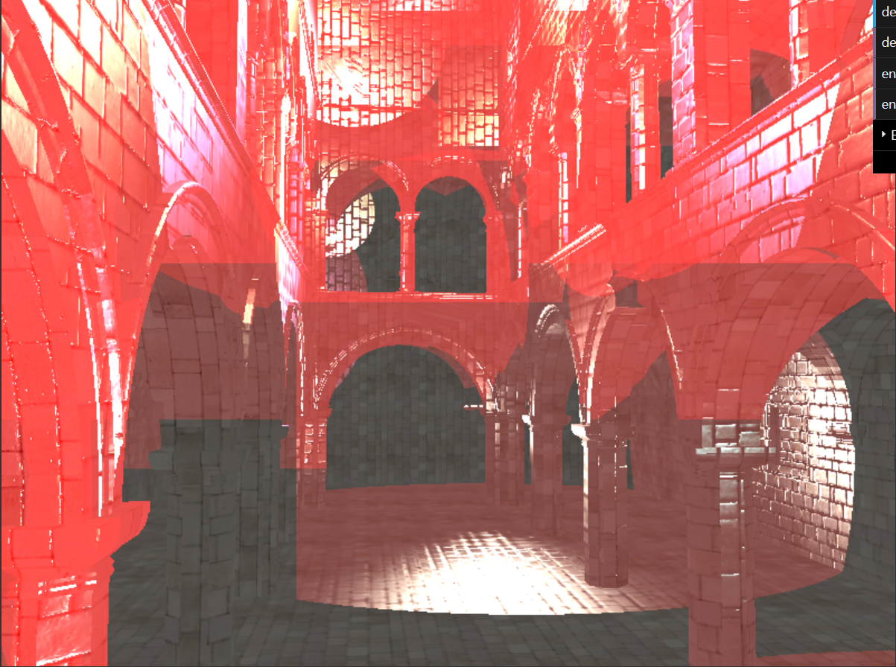
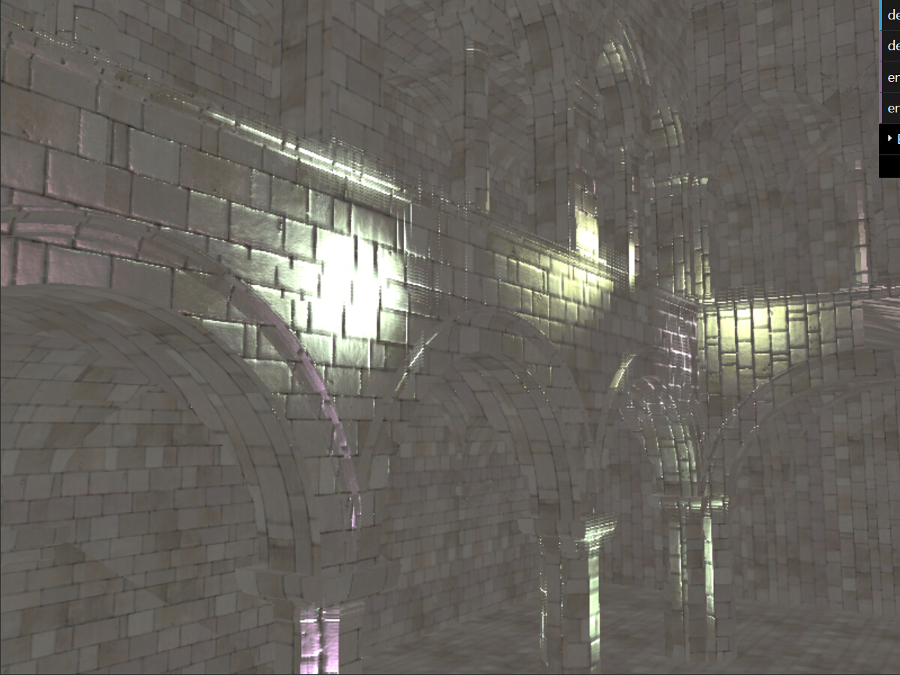

WebGL Deferred Shading
======================

**University of Pennsylvania, CIS 565: GPU Programming and Architecture, Project 6**

siqi Huang Tested on: Windows 7, Inter(R) Core(TM) i7-4870 HQ CPU@ 2.5GHz; GeForce GT 750M(GK107) (Personal Computer)

#Representative Images:

#Part O: Browser Setup
This should be a very easy part, as many browser nowadays support WebGl 1.0 or higher. But in my case I still have problems and spend a whole day dealing with it. First I tried to use Chrome but it seems that it only support WebGl 1.0. To enable the WebGl 2.0, you have to add parameter in its command line[1]. This method work fine in majority of time, but unlucky I am not in that range, so I turn to FireFox and setup the browser for WebGl.

#Part I: Simple Red Squad
For this part I still used much time. Really not familiar with the js function. In general, what I did is create and bind buffer, give point location to shader and render. After all this, the dark screen is in red.

#Part II: Debug Views
After pass value to the copy.vert.glsl. All debug view is easy to get.

1 Depth: Simply use depth value to render.

2 Position: Simply use position to render

3 Geometry Normal: Simply use geometry normal to render

4 Color Map: Simply use color map to render

5 Normal Map: Simply use normal map to render

6 Surface Normal: Use normal map*geometry normal to render

# Part III: Ambient Shader(With Toon Shading)
Here the default value is black. I use the color map(texture) as its ambient color. Because the texture is too light, I use 0.4*colorMap instead. Then I implemented toon shading. Given the eye position, we can get the toon shading using lambert's law(somewhat like diffuse shading). However, here we divide color into 4 levels based on the angle between the eye and the normal. So we get the result like this:

# Part VI: Blinn-Phong Shader(With Lighting Fade Off)
To implement the bline-phone effect, we need the camera position. Then using the light position we get the result. To improve the performance, we used scissor test to restrict the change of pixes are only within the scissor square. The scissor square is like:

Then in the actual rendering, the lighting fade off is set to be linear. So we get the result here like:

The specular coefficient is a random number between 1 and 60, with is passed to the shader with the G-buffer.

# Part V: Bloom Shading(With Two Passes)
The idea of bloom shading here is to get the result color from the blinn-phong shader first and post processing twice to get the bluring images. Using the Guassian function we first do the texture(color) offset in x direction. Then push the color back and reuse in the second pass, and then we do the texture(color) offset in y direction. The number of offset is 10 in both direction, and the coefficient for Guassian fade off is 0.8. If the color to be add is less than 0.8 in length, then discard it and use the original color. So after blurring, the result is like:

